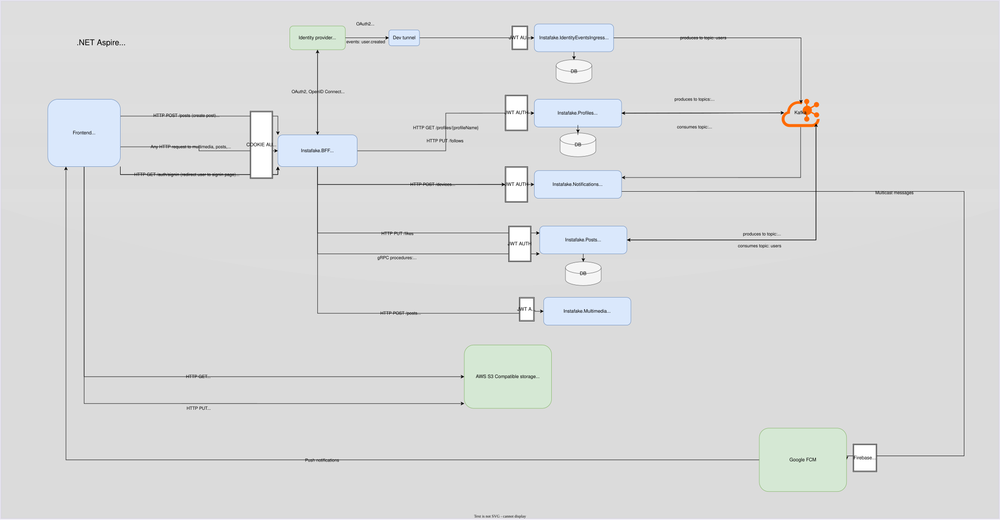

# Instafake
App that tries to behave (not necessarily look) like Instagram. Built with high-scale kept in mind.

## Current local dev architecture

## Important or not obvious decisions
### BFF (Backend for Frontend)
- #### Why this pattern?
    - In order to provide best users security, OAuth2 confidential client must be used. That client cannot be frontend app. BFF can achieve that via using basic cookie auth, where cookies depend on OIDC auth process. Furthermore, BFF can also act as API Gateway, aggregator and reverse proxy. Switches between authz forms, seamlessly handles access token expiration.

### Multimedia service
- #### Why AWS S3 compatible storage?
    - AWS S3 provides pre-signed upload URLs feature. It allows to securely upload multimedia directly to the storage, effectivelly omitting proxying through internal services thus saving a lot of resources.

### Identity events ingress service
- #### Why does it require Kafka idempotence (thus acks=all is forced)?
    - We avoid duplicated events from producer retries. More importantly, identity events are the most important ones in whole workflow. If event is not handled successfully, users may have problems with performing actions in the future (e.g. handle of 'user.created' failed, user cannot create posts etc.).

### Posts & Profiles service
- #### Why clean architecture?
    - In this project, domain is not the source of complexity. It may look like overengineering, especially when we build app that has to work on high-scale. However, the expected amount of integrations and the need to emphasize specific aspects of the code makes it a great choice.

- #### What are these specific aspects?
    - Performance. In this project CQRS implementation breaks some DDD rules - and it's done purposely. Typically in DDD, command/query handlers sit in the application layer, but this project implements query handlers in infrastructure layer. It screams loudly: "that handler has to sit close to the database and make use of all optimization techniques this database provides". The use of loosely coupled anemic domain entities (though they are intuitively very coupled) comes up with similar effect. We seek performance, not ideal consistency.

    - Of course, we could create more specialized application layer repositories or services in order to satisfy DDD. However, that would create empty, pass-through abstraction layers and a lot of unnecessary code while losing the emphasis of what is really important.

    #### Migration to Wolverine
    - After not really planned migration to Wolverine, this architecture lost a bit. It is because in order to maximize performance and use code generation, most of the code has to be public, so we leak a lot to the Api layer. We could avoid this using normal DI, but it costs performance. From the exprience I've gained, I would rather use vertical slices.

- #### Why gRPC?
    - Where its used, it doesn't help a lot. It was implemented purely to show I had exposure to it, dealt with some related issues. But, in this case, why isn't this fast binary protocol better than just REST with JSON? It's due to how communication happens where gRPC is implemented: frontend -> BFF -> posts. Browsers do not support gRPC, so BFF have to deserialize JSON, serialize it to gRPC message, then deserialize gRPC response to JSON. No performance gains, unnecessary overhead and code duplication.

- #### Why CQRS, and how?
    - Again, performance. We don't want to load whole infrastructure layer entities (a lot of data, joins, relationships), map to domain layer entities, then to application layer DTOs. We just want some data to satisfy UI! Additionally, the demand of QUERY posts is expected to be much higher than CREATE/LIKE post. In the future, the clear separation of read/write could be helpful when redesigning db architecture (e.g. separate write-only and read-only).
    - As mentioned above, query handlers sit in infrastructure layer. But what about commands? They are in application layer, because during writes we want our data to be valid (in application layer we are forced to use repositories, which use domain entities, which always preserve valid state)

- #### A bit about database and storage
    - MSSQL isn't really good choice because scaling it horizontally is complex. I introduced it only for dev time.
    - Some entities are denormalized. Why? You already know :). For example, reading count of items from row is much faster than performing COUNT().
    - Neither MSSQL nor PostgreSQL are good for +1 or -1 updates (updating denormalized columns, e.g. likes count), due to locks, disk I/O just for simple operations, and MVVC in case of PostgreSQL. I'm planning to use Redis to buffer these operations, and sync the values using background workers.
    - Composite indexes on {date, id} (id is tie breaker). They are used for very efficient cursor pagination - we can use WHERE on these fields, and pagination is done in O(logN + K), without growing linearly like with offset. Without this composite index, the cursor pagination would still need to perform O(n) search.

### Profiles service
- #### Database
    - Code is prepared to work with distributed database. For Follows table, sharding has to be done with on ProfileId and BucketId.

- #### Sending notifications to followers
    - We could easily just use Firebase topics, but I wanted to do some work.
    - To maximize performance, fanout pattern has been used. When we receive "post.created" event, we emit initial "post.notification.fanout.next" to the Kafka. That specific event handles batch of buckets (500), and the server which receives it sends another "post.notification.fanout.next" to process, containing another batch of buckets. This way, we know where we fail and where to start after failure, and by using batches we can parallelize sending "post.notification", so that notifications can be handled in parallel by notifications service instances. For user with 100_000_000 followers, with proposed configuration (bucket_size = 5000, batch_size = 500), there is gonna be 20_000 buckets. We handle 500 buckets per event, so 40 "hops" (fanout.next) are gonna be emitted, which isn't much. Then, we select all follower ids from bucket batches (5000 * 500 = 2_500_000) which is pretty much but follower id isnt very heavy (we can change params or select in batches). For every bucket, we emit "post.notification" to Kafka, which contains all follower ids from single bucket (5000 follower ids).

### Notifications service
- #### Handling "post.notification"
    - When we receive "post.notification", we select device tokens corresponding to given follower ids (up to 15_000 assuming every user has 3 devices). Then, in batches of 500 tokens, we send multicast messages to Google FCM. It is around 15_000/500 = 30 requests to Google FCM.